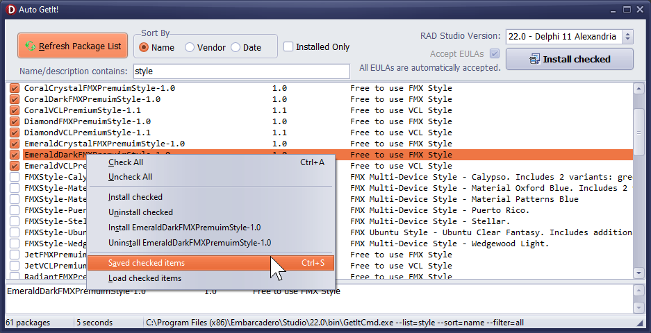

# AutoGetIt
The idea with this small Delphi program is to automate the [GetIt package manager](http://docwiki.embarcadero.com/RADStudio/Sydney/en/Installing_a_Package_Using_GetIt_Package_Manager) for RAD Studio (Delphi) by calling the GetIt command-line tool that comes with Delphi.  Every time there's an update or a need to reinstall, it's a pain to tediously and manually go through all the GetIt packages you may want and reinstall them all. This can be done on the command-line but the documentation for GetIt is weak.

This Delphi program uses the DosCommand component (available on GetIt) to shell out to the GetItCmd.exe and show all the packages in a CheckListBox. You then simply check off all the packages you want to install, click the Install button, and sit back and watch them all get installed (some require authorization so it's not completely unattended).

_Written in Delphi 10.4.1, tested on the update to Delphi 10.4.2_

## Planned updates

The program has two features not yet implemented:

- Uninstall: I have not yet implemented uninstalling GetIt packages.
- Saving the list: For automation without needing to use batch files, the list of packages selected to be installed will be saved for later recall.

## Batch files

If you don't want to run the GUI, I also wrote a bunch of batch files that do the same thing but with pre-selected groups of packages.  I basically dumped all the packages into a text file then prepended the GetIt command line to install them and separated them into variously grouped batch files, some duplicated among a couple of groups. If you haven't already done this for your install, this will help get you started.

To run the batch files, start a DOS Prompt as Administrator, run the `rsvars.bat` batch file from your Delphi folder, then run any of the batch files in the `batch`  folder. You will want to modify the batch files and comment out the packages you don't want.

